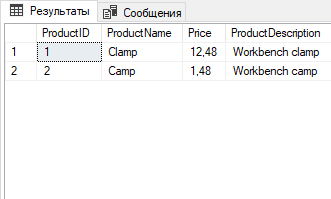
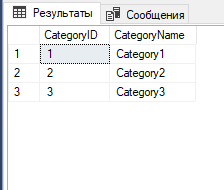
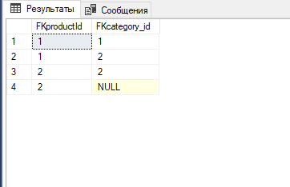
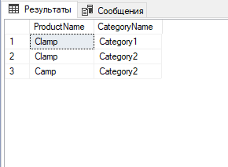

# Вычисление площади треугольника и круга
* Добавлены юнит-тесты
* Добавлена проверка на то, является ли треугольник прямоугольным 
# SQL-запрос
[SQL-запрос на pastebin](https://pastebin.com/zgfPij2W)  

## Примеры таблиц, которые представлены в запрос на pastebin  

  

  

  
## Результат запроса  

